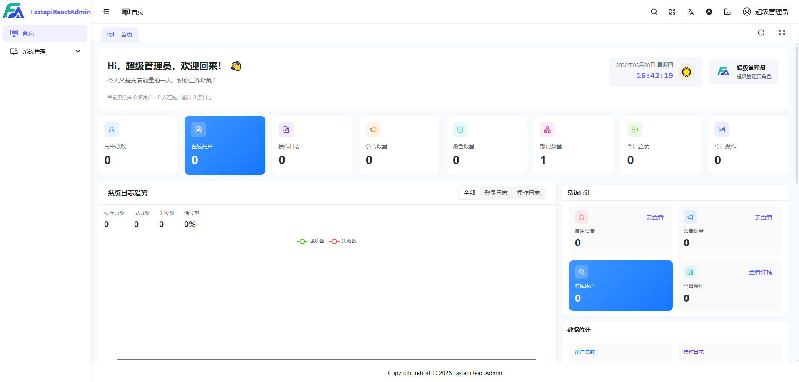
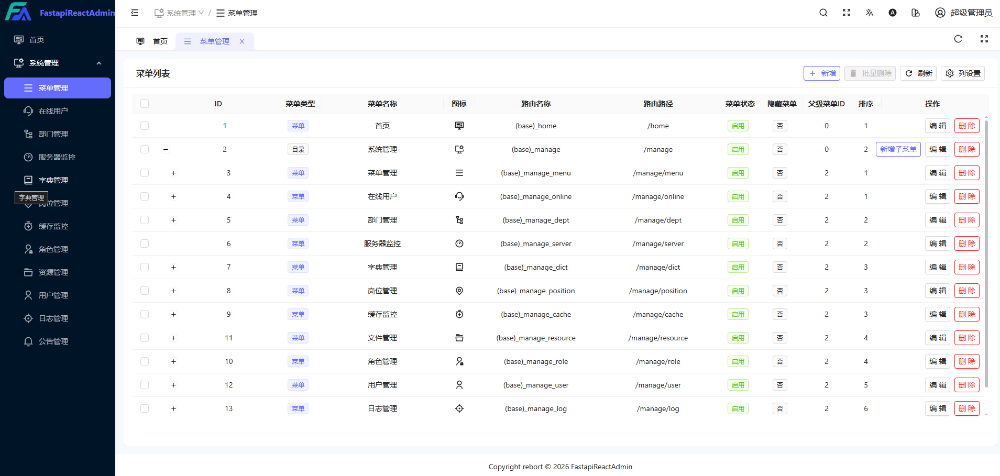
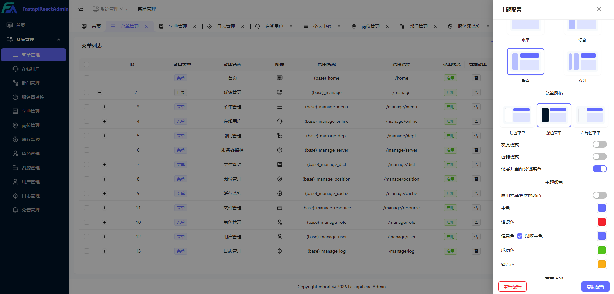

<div align="center">
     <p align="center">
          
     </p>
     <h1>FastApireactAdmin <sup style="background-color: #28a745; color: white; padding: 2px 6px; border-radius: 3px; font-size: 0.4em; vertical-align: super; margin-left: 5px;">v1.0.0</sup></h1>
     <h3>🚀 开箱即用，高效，纯洁，完整RBAC，5 分钟搭建企业级中后台</h3>
     <p>基于 <b>FastAPI + React19 + TypeScript</b> 的全栈快速开发平台，一站式交付，简单高效，开箱即用</p>
     <p align="center">
          <a href="https://github.com/rebort-hub/fastapiReactadmin" target="_blank">
               
          </a>
          <a href="https://github.com/rebort-hub/fastapiReactadmin" target="_blank">
               
          </a>
          <a href="https://github.com/rebort-hub/fastapiReactadmin/forks" target="_blank">
               
          </a>
          <br>
          <a href="https://github.com/rebort-hub/fastapiReactadmin/blob/master/LICENSE" target="_blank">
               
          </a>
          
          
          
          
     </p>

简体中文 | [English](./README.en.md)

</div>

## 💡 为什么选择 FastapiReactadmin？

| 你需要的 | fastapiReactadmin | Django Admin | 纯前端模板 |
|---------|:-----------:|:-----------:|:---------:|
| 🎯 **开箱即用**的后台系统 | ✅ | ⚠️ 功能有限 | ❌ 只有 UI |
| ⚡ **FastAPI 异步**高性能后端 | ✅ | ❌ 同步为主 | ❌ 无后端 |
| 🔐 **RBAC** 菜单/按钮/数据三级权限 | ✅ | ❌ 基础 | ❌ |
| 🐳 **Docker 一键部署**（含 Nginx + SSL） | ✅ | ❌ | ❌ |


## 🚀 只需简简单单 5 分钟，本地即可快速跑起来前后端项目

```bash
# 1. 克隆
git clone https://github.com/rebort-hub/fastapiReactadmin.git

# 2. 配置环境
cp backend/env/.env.dev.example backend/env/.env.dev

# 3. 启动后端（首次自动建表 + 初始化数据）
cd backend 

# 创建虚拟环境
# MAC操作
python -m venv .venv
source .venv/bin/activate  
          
# Windows操作: 
python -m venv .venv
.venv\Scripts\activate

# 建表初始化
uv sync 

# 启动服务
uv run main.py run

# 4. 启动前端
cd reackweb 

# 安装依赖
pnpm install

# 启动前端
pnpm run dev

# ✅ 浏览器打开 http://127.0.0.1:5173，用 admin/123456 登录
```

| 环境要求 | |
|---------|------|
| Python ≥ 3.10（推荐 3.12） | Node.js ≥ 20.0 + pnpm |
| MySQL 8.0+ / PostgreSQL 14+ | Redis 6.x / 7.x |

## 📦 工程结构

```
fastapiReactadmin/            # Monorepo 全栈工程
├─ backend/              # FastAPI 后端（Pydantic 2.0 + SQLAlchemy + Alembic）
├─ reackweb/             # react Web 前端（Ant+ TypeScript）            
├─ docker/               # Docker Compose 一键部署（Nginx + SSL）
├─ deploy.sh             # 一键部署脚本
```

## 📌 内置功能（开箱即用）

| 模块      | 包含能力 |
|---------|------|
| 📊  首页  | 数据分析 |
| ⚙️ 系统管理 | 用户 / 角色 / 菜单 / 部门 / 岗位 / 字典 / 配置 / 公告 |
| 👀 监控管理 | 在线用户 / 服务器监控 / 缓存监控 |
| 📋 任务管理 | 定时任务调度 |
| 📝 日志管理 | 操作日志审计 |
| 🧰 开发文档 | 接口文档 |
| 📁 文件管理 | 统一文件管理 |
| 🤖 智能体  | 基于 Agno 的智能体框架 |

## 🔧 截图展示

| 登录 | 仪表盘 | 系统管理 | 主题切换 |
| ---- | ------ | -------- | ------- |
|  |  |  |  |


## 👥 社区与支持

| QQ群                                  | 赞赏支持 |
|--------------------------------------| -------- |
|  |  | 

> 如果你觉得项目有用，请给一个 ⭐️ Star 支持！

## 🙏 鸣谢

- 后端：[FastAPI](https://fastapi.tiangolo.com/) · [Pydantic](https://docs.pydantic.dev/) · [SQLAlchemy](https://www.sqlalchemy.org/) · [APScheduler](https://github.com/agronholm/apscheduler)
- 前端：[TypeScript](https://www.typescriptlang.org/) · [Vite](https://vitejs.dev/) · [Ant Design](https://ant.design/index-cn)
- AI：[Agno](https://github.com/agno-agi/agno)
- soybean [Soybean](https://github.com/honghuangdc) 
